# Arquitectura objetivo y decisiones de producto

## Decisión principal

Separar una **skill directora** de un **motor musical verificable**. El agente interpreta intención, propone alternativas y negocia revisiones. El motor conserva restricciones, eventos y procedencia. El renderer realiza una interpretación declarada. Ninguno sustituye la evaluación musical humana.

No se exige modelo generativo externo, GPU, cuenta ni nube. Un backend neuronal puede implementarse después como candidato opcional detrás de los mismos contratos. El problema de coherencia no se resuelve por sustituir toda la arquitectura por una API de audio.

```mermaid
flowchart LR
  B[Brief y función de juego] --> C[Capacidades verificadas]
  C --> D[Tres direcciones en reducción]
  D --> U[Elección humana]
  U --> I[Identidad protegida]
  I --> F[Forma y destinos de frase]
  F --> H[Armonía y conducción]
  H --> A[Arreglo por funciones]
  A --> P[Interpretación por instrumento]
  P --> R[Backend declarado]
  R --> Q[Audio, MIDI y pruebas]
  Q --> G[Simulación de gameplay]
  G --> V[Revisión localizada]
  V --> I
```

## ADR-01 · Representaciones separadas y versionadas

El plan es intención; el score es estructura musical; la performance es una realización; el render es señal. No sobrecargar `performance_beat` para evaluar forma ni utilizar una etiqueta `factory_patch` como evidencia de señal producida por ese patch.

Contratos objetivo, no formatos soportados actualmente por `neospc.py`:

| Contrato | Contenido mínimo |
|---|---|
| `ThemeIdentity` | ID estable, núcleo de alturas/grados, onsets, duraciones, acentos, respiración, ancla, invariantes y transformaciones permitidas. |
| `SectionPlan` | ID, rango, función tipada, objetivo de frase/cadencia, foreground, curvas separadas de energía/tensión/densidad/registro y presupuesto de silencio. |
| `HarmonyEvent` | Inicio y duración en tiempo musical, root, notas, función, inversiones, notas no armónicas permitidas y objetivo de resolución. No limitarlo a un acorde por compás. |
| `ScoreEvent` | ID estable, voz/rol/instrumento, tiempo musical exacto, pitch y articulación estructural. |
| `PerformanceEvent` | Referencia al evento fuente, offset, duración realizada, velocity, afinación, articulación y automatización. |
| `RenderManifest` | Hash de entradas, backend/versiones, assets realmente resueltos, calibración, sample rate, codecs, loops, stems, medidores y errores. |
| `RevisionContract` | Base hash, alcance, preservaciones, cambios permitidos, motivo y postcondiciones. |
| `TransitionGraph` | Estados, entradas/salidas armónicas, puntos de sincronía, transiciones, latencia máxima, excepciones y trazas. |

Versionar esquemas y migraciones; preservar los JSON actuales durante la transición. No aceptar JSON de laboratorio como score Neo-SPC por coincidencia de nombres. El laboratorio ya exporta `backend`, `production_ready:false` y advertencias.

## ADR-02 · Determinismo local y edición protegida

Semillas derivadas de `(project_seed, theme_id, stage, section_id, voice_id, variation_id)`, no del orden de recorrido de todo el score. Revisar B no debe cambiar aleatoriamente A ni timbres de otras pistas.

Una transacción de revisión comprueba `base_hash`, aplica únicamente el alcance permitido, valida y produce un diff semántico. Si una revisión cambia el presupuesto o armonía de un vecino, eso es un conflicto para resolver, no permiso para regenerar todo. Undo conserva artefactos y decisión anterior; no sólo una seed.

Las restricciones duras son tiempo válido, registro, articulación realizable y locks. Las preferencias blandas son conducción, cantabilidad, tensión y economía. Si una búsqueda no encuentra solución, debe devolver un diagnóstico o relajación propuesta. No ocultar ese fracaso con clamp.

## ADR-03 · Composición jerárquica y búsqueda acotada

Generar arquitectura de frase y objetivos antes de notas ornamentales. Elegir entre gramáticas musicalmente diferentes: período, sentencia, células rituales, riff con respuesta, desarrollo secuencial, campo ambiental y variantes asimétricas. No convertir todo en A/A'/B/A por defecto: esa es sólo la forma reducida del laboratorio.

Un buscador acotado puede escoger notas y voicings usando objetivos de acorde en pulsos fuertes, conducción, preparación/resolución y restricciones de instrumento. Conservar varias soluciones válidas antes de ordenar preferencias. No maximizar una «variedad» que destruya recurrencia ni aplicar reglas diatónicas a todo género.

La orquestación es un conjunto de funciones y turnos. Presupuesto de voces, número de instrumentos y número de canales son conceptos independientes. Una entrada de ensamble debe justificar el desplazamiento del foreground o sumar una función ausente.

## ADR-04 · Paridad explícita de backends

Crear `resolve_patch(instrument, profile, register, velocity, articulation)` con resultado inspeccionable y provenance. Puede fallar o devolver fallback declarado; no fingir timbres inexistentes. Resolver el mismo contrato en browser y native o publicar diferencias intencionales con pruebas.

La caché debe incluir contenido de score/performance, renderer y adaptador, samples, calibración, opciones y dependencias que afectan señal. Un output incompleto/corrupto invalida la reutilización. Mantener la exportación MIDI como interpretación GM declarada, no como garantía de mismo timbre.

Stems: compartir origen temporal, duración y cola. Publicar si son pre-bus, post-bus o contribuciones al master. No prometer que suman al master cuando hay saturación/limitación no lineal independiente o efectos compartidos duplicados. Entregar mezcla de referencia y residual medido según el contrato.

## ADR-05 · Gameplay como grafo musical, no slider de volumen

Combinar reorquestación vertical y secuencias horizontales. Una transición cuantizada al compás puede seguir siendo armónicamente incorrecta: validar armonía de salida, llegada, notas sostenidas y latencia de gameplay. Añadir hysteresis, mínimo de permanencia y cooldown para que señales ruidosas no hagan oscilar el score.

Flujo inicial: exploración → peligro → combate → resolución. Una emergencia puede necesitar stinger/duck inmediato mientras la base espera un punto seguro. Registrar qué regla ganó. La integración inicial debe ser un adaptador pequeño para el entorno elegido y un simulador; no prometer simultáneamente soporte completo de Phaser, Godot, Unity, FMOD y Wwise.

## Experiencias distintivas que merecen prototipos

**Un tema, toda una historia.** El usuario aprueba un gesto y obtiene una familia coherente: encuentro, traición, duelo y victoria. Un visor muestra la genealogía y permite oír qué permanece. El lab demuestra un caso limitado; producción necesita contratos de transformación, audio y evaluación de reconocimiento.

**Presagio del jefe.** Una célula del antagonista aparece fragmentada en ambiente, ciudad o percusión y se revela completa en combate. El usuario decide cuánto anticipar y dónde. No repartir el mismo ostinato alto en toda la banda sonora: hace falta un mapa narrativo y límites de repetición.

**Del mundo a la partitura.** Una melodía diegética breve —campana, instrumento de taberna, voz sin letra— se transforma en score no diegético cuando cambia la escena. Se conserva su identidad, no sólo se añade reverb. Assets siempre originales o con licencia trazable.

**Cirugía musical.** «El compás 7 no cae bien; mantené el resto» produce un diff local, replay alineado y rollback. El valor es la confianza de no perder una buena toma. El prototipo sólo cubre lead de B; es un demostrador de ese contrato, no edición universal.

**Espacio para el juego.** Una capa de diálogo/SFX hace escuchar arreglos alternativos con menos foreground y huecos deliberados. No limitarse a bajar toda la música ni usar micrófono sin consentimiento.

**Presupuesto de fatiga.** Banco de variaciones con una memoria de qué ya se oyó; controla recurrencia, respiración y tiempo entre clímax. No hay un «fatigue score» universal. La prueba decisiva son sesiones largas y tasas de mute en contexto, no complejidad creciente.

## Qué no construir primero

No iniciar con otro piano roll completo, editor de audio destructivo, comunidad, cuentas, marketplace, entrenamiento propio, generación de voz, ingestión arbitraria de canciones comerciales o automatización de compra de plugins. Primero probar que un creador puede conservar una idea, revisarla y llevarla al juego con menos fricción y mejores resultados.

La portada del showcase debería exponer este recorrido como una pieza corta y reproducible. Conservar el catálogo como evidencia y comparación; no confundir «100 ejemplos» con cobertura del workflow de creación.
